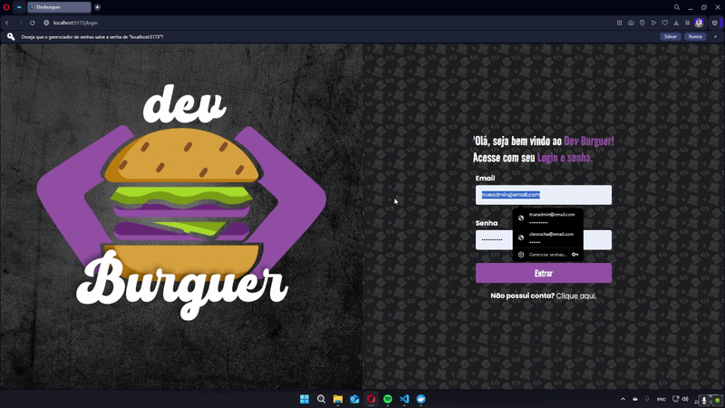

# 🍔 CodeBurguer — Frontend

<p align="center">
  
</p>

Interface web de uma hamburgueria virtual full stack, com fluxo completo de compra, carrinho de itens, checkout e integração com pagamento via Stripe.

[](https://github.com/MaximillionDev1/CodeBurguer-api)


---

## 🚀 Tecnologias

| Camada | Tecnologia |
|---|---|
| UI | React + Vite |
| Estilização | Styled Components |
| Roteamento | React Router DOM |
| HTTP | Axios |
| Pagamento | Stripe (checkout) |
| Feedback | React Toastify |
| Responsividade | React Responsive |

---

## ✨ Funcionalidades

- 🔐 Cadastro e login de usuários com autenticação JWT
- 🛒 Carrinho de compras com adição, remoção e atualização de itens
- 📦 Catálogo dinâmico de produtos por categoria
- 💳 Checkout com integração Stripe
- 📱 Layout responsivo para mobile, tablet e desktop
- 🔔 Notificações de feedback com React Toastify

---

## ⚙️ Como rodar localmente
```bash
# Clone o repositório
git clone https://github.com/MaximillionDev1/CodeBurguer.git
cd CodeBurguer

# Instale as dependências
yarn install

# Configure o ambiente
cp .env.example .env
# Edite o .env com a URL da sua API

# Inicie o servidor de desenvolvimento
yarn dev
```

> ⚠️ Este frontend depende da [CodeBurguer API](https://github.com/MaximillionDev1/CodeBurguer-api) rodando localmente ou em produção.

---

## 📁 Estrutura
```
src/
├── components/   # Componentes reutilizáveis (Header, Cart, Modal...)
├── containers/   # Páginas principais (Home, Login, Register, Cart)
├── routes/       # Configuração de rotas públicas e privadas
├── services/     # Configuração do Axios e chamadas à API
└── styles/       # Estilos globais e temas
```

---

## 🔗 Repositório do Backend

A API que alimenta este frontend está disponível em:
👉 [CodeBurguer-api](https://github.com/MaximillionDev1/CodeBurguer-api) — Node.js · Express · PostgreSQL · MongoDB · JWT · Stripe

---

## 👨‍💻 Autor

**Matheus Vinicius** · [GitHub](https://github.com/MaximillionDev1) · [LinkedIn](https://www.linkedin.com/in/matheus-vinicius-dev)

## 📄 Licença

MIT
